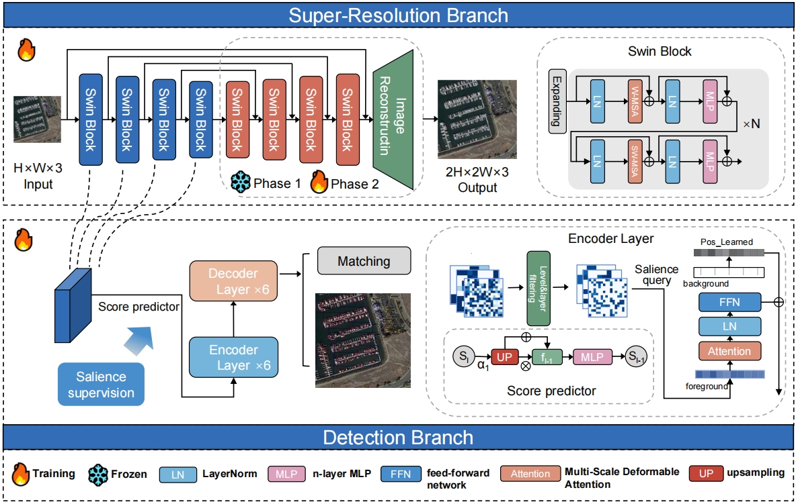
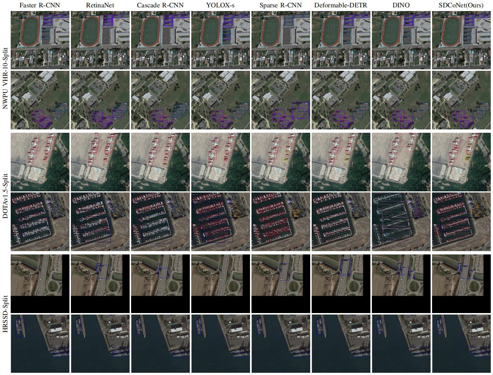
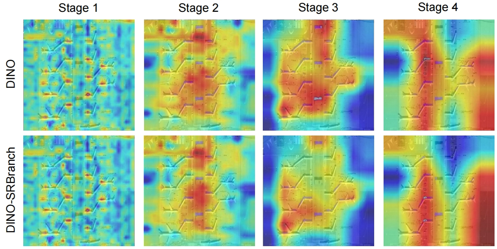

# SDCoNet

# SDCoNet: Saliency-Driven Multi-Task Collaborative Network for Remote Sensing Object Detection

<div align="center">

[](https://github.com/qiruo-ya/SDCoNet)
[](https://www.python.org/)
[](https://pytorch.org/)
[](https://github.com/open-mmlab/mmdetection)
[](LICENSE)

**[Ruo Qi](mailto:qiruo2023@email.szu.edu.cn), [Linhui Dai*](mailto:dailinhui@szu.edu.cn), Yusong Qin, Chaolei Yang, Yanshan Li**


</div>

---

## 📋 Overview

SDCoNet is a **Saliency-Driven multi-task Collaborative Network** designed for small object detection in low-quality remote sensing imagery. Unlike traditional serial SR-detection pipelines, SDCoNet couples super-resolution and detection through implicit feature sharing while preserving task specificity.

### Key Features

- 🔗 **Implicit Feature Sharing Paradigm**: Enables semantically consistent collaboration between SR and detection tasks
- 🎯 **Saliency-Driven Query Token Selection**: Dynamically focuses on small object regions and suppresses feature pollution
- ⚡ **Gradient Routing Strategy**: Alleviates optimization conflicts between reconstruction and detection
- 🚀 **Competitive Efficiency**: Achieves 5× FLOPs reduction compared to serial baselines while improving accuracy

---

## 🏗️ Architecture

<!-- 
TODO: Add your network architecture figure here
Recommended: Save as 'assets/architecture.png' or 'figures/framework.png'
-->

<div align="center">

<p><em>Figure 1: The framework pipeline of SDCoNet. Our SDCoNet comprises two core branches: super-resolution and object detection, consisting of a shared encoder, a super-resolution decoder, a saliency-driven query filtering module, and an object detection encoder-decoder.</em></p>
</div>

---


## 🔧 Installation

### Requirements

- Python >= 3.8
- PyTorch >= 1.10
- CUDA >= 11.1
- MMDetection >= 3.0

### Step-by-Step Installation

```bash
# Clone the repository
git clone https://github.com/qiruo-ya/SDCoNet.git
cd SDCoNet

# Create conda environment
conda create -n sdconet python=3.8 -y
conda activate sdconet

# Install PyTorch (adjust CUDA version as needed)
pip install torch==1.12.1+cu113 torchvision==0.13.1+cu113 --extra-index-url https://download.pytorch.org/whl/cu113

# Install MMDetection dependencies
pip install -U openmim
mim install mmengine
mim install "mmcv>=2.0.0"

# Install MMDetection
pip install mmdet

# Install other dependencies
pip install -r requirements.txt

# Install SDCoNet
pip install -e .
```

---

## 📁 Dataset Preparation

### Dataset Structure

```
data/
├── NWPU_VHR10_Split/
│   ├── train/
│   │   ├── images/
│   │   └── annotations/
│   └── test/
│       ├── images/
│       └── annotations/
├── DOTAv1.5_Split/
│   ├── train/
│   │   ├── images/
│   │   └── annotations/
│   └── test/
│       ├── images/
│       └── annotations/
└── HRSSD_Split/
    ├── train/
    │   ├── images/
    │   └── annotations/
    └── test/
        ├── images/
        └── annotations/
```

### Dataset Download

| Dataset | Images | Categories | Download |
|:-------:|:------:|:----------:|:--------:|
| NWPU VHR-10 | 3,631 | 10 | [Link](https://github.com/chaozhong2010/VHR-10_dataset_coco) |
| DOTAv1.5 | 15,883 | 16 | [Link](https://captain-whu.github.io/DOTA/) |
| HRSSD | 53,056 | 13 | [Link](https://github.com/TongkunGuan/SRSSD) |

---

## 🚀 Training

### Single GPU Training

```bash
# Train on NWPU VHR-10-Split
python tools/train.py

```


## 📈 Evaluation

### Test Single Model

```bash
# Evaluate on NWPU VHR-10-Split
python tools/test.py
```


## 🔬 Visualization

### Detection Results

<!-- 
TODO: Add your visualization results here
Recommended: Save as 'assets/visualization.png'
-->

<div align="center">

<p><em>Figure 2: Qualitative detection results comparing SDCoNet with state-of-the-art methods.</em></p>
</div>

### Feature Map Visualization

<!-- 
TODO: Add your feature visualization here
Recommended: Save as 'assets/feature_maps.png'
-->

<div align="center">

<p><em>Figure 3: Visualization of intermediate feature maps showing the effect of SR branch on representation quality.</em></p>
</div>

---

## 📖 Citation

If you find this work useful in your research, please consider citing:

```bibtex
@article{qi2025sdconet,
  title={SDCoNet: Saliency-Driven Multi-Task Collaborative Network for Remote Sensing Object Detection},
  author={Qi, Ruo and Dai, Linhui and Qin, Yusong and Yang, Chaolei and Li, Yanshan},
  year={2025},
}
```

---

## 🙏 Acknowledgements

This project is built upon the following open-source projects:

- [MMDetection](https://github.com/open-mmlab/mmdetection)
- [DINO](https://github.com/IDEA-Research/DINO)
- [Swin Transformer](https://github.com/microsoft/Swin-Transformer)

We thank the authors for their excellent work.

---

## 📧 Contact

For any questions, please contact:

- **Ruo Qi**: qiruo2023@email.szu.edu.cn

---

## 📄 License

This project is released under the [Apache 2.0 License](LICENSE).

---

<div align="center">

**If you find SDCoNet useful, please give us a ⭐!**

</div>
